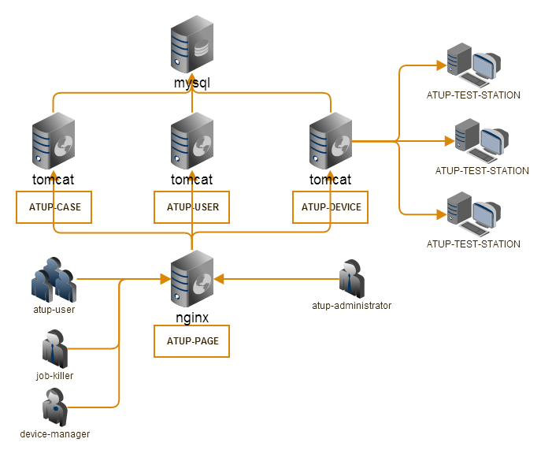

#Java Restful Web Service使用指南#
#综合示例 ATUP#
[**http://feuyeux.github.io/jax-rs2-atup/**](http://feuyeux.github.io/jax-rs2-atup)

### build ###
> mvn clean install -DskipTests -PCI

### Unit Test ###
> mvn clean install -PTI
>
> curl -X POST http://localhost:8080/atup-device/rest-api/devices/status
>
> curl -X POST http://localhost:8080/atup-case/rest-api/testjobs/jobs?count=1

### Datasource Setting ###
Context.xml:
	
	<Resource name="jdbc/AtupDataSource"
        	auth="Container" type="javax.sql.DataSource"
        	driverClassName="org.gjt.mm.mysql.Driver"
        	url="jdbc:mysql://localhost:3306/jaxrs2_atup"
        	username="root"
        	password="root"
        	maxActive="20"
        	maxIdle="10"
        	maxWait="-1" />
	
### Maven Setting ###
####resources properties####
[http://mojo.codehaus.org/properties-maven-plugin/usage.html](http://mojo.codehaus.org/properties-maven-plugin/usage.html)

     pom.xml
     <build>
            <finalName>atup-user</finalName>
            <resources>
                <resource>
                    <directory>src/main/resources</directory>
                    <filtering>true</filtering>
                </resource>
            </resources>

     <profile>
        <id>CI</id>
        <build>
            <plugins>
                <plugin>
                    <groupId>org.codehaus.mojo</groupId>
                    <artifactId>properties-maven-plugin</artifactId>
                    <version>1.0-alpha-2</version>
                    <executions>
                        <execution>
                            <phase>initialize</phase>
                            <goals>
                                <goal>read-project-properties</goal>
                            </goals>
                            <configuration>
                                <files>
                                    <file>src/main/resources/section/staging.properties</file>
                                </files>
                            </configuration>
                        </execution>
                    </executions>
                </plugin>
            </plugins>
        </build>
    </profile>

    resources/section/staging.properties
    db.server.address=10.11.72.54
    db.driver=com.mysql.jdbc.Driver
    db.url=jdbc:mysql://${db.server.address}:3306/jaxrs2_atup
    db.username=root
    db.password=root

####token replacer####
[https://code.google.com/p/maven-replacer-plugin](https://code.google.com/p/maven-replacer-plugin/)

    pom.xml
    <properties>
        <main.basedir>${project.parent.basedir}</main.basedir>
    </properties>

    <profile>
        <id>CI</id>
        <build>
            <plugins>
                <plugin>
                    <groupId>com.google.code.maven-replacer-plugin</groupId>
                    <artifactId>replacer</artifactId>
                    <version>1.5.2</version>
                    <executions>
                        <execution>
                            <phase>validate</phase>
                            <goals>
                                <goal>replace</goal>
                            </goals>
                        </execution>
                    </executions>
                    <configuration>
                        <file>${main.basedir}/atup-page/src/main/webapp/js/index_buildtime.js</file>
                        <outputFile>${main.basedir}/atup-page/src/main/webapp/js/index.js</outputFile>
                        <replacements>
                            <replacement>
                                <token>@buildtime@</token>
                                <value>${maven.build.timestamp}</value>
                            </replacement>
                        </replacements>
                    </configuration>
                </plugin>
            </plugins>
        </build>
    </profile>

    index_buildtime.js
    function markVersion() {
        jQuery('#buildDiv').html("Build Time: @buildtime@");
    }

####file replace####

    pom.xml
    <id>CI</id>
            <build>
                <plugins>

                    <plugin>
                        <groupId>org.apache.maven.plugins</groupId>
                        <artifactId>maven-antrun-plugin</artifactId>
                        <version>1.7</version>
                        <executions>
                            <execution>
                                <phase>initialize</phase>
                                <configuration>
                                    <target>
                                        <copy file="src/main/webapp/js/atupCommon_staging.js"
                                              tofile="${project.build.directory}/${project.artifactId}-${project.version}/js/atupCommon.js" overwrite="true" />
                                    </target>
                                </configuration>
                                <goals>
                                    <goal>run</goal>
                                </goals>
                            </execution>
                        </executions>
                    </plugin>
                </plugins>

#### mysql initialize ####
sql-maven-plugin

    parent/pom.xml:
    <plugin>
        <groupId>org.codehaus.mojo</groupId>
        <artifactId>sql-maven-plugin</artifactId>
        <version>${sql-maven-plugin.version}</version>
        <dependencies>
            <dependency>
                <groupId>mysql</groupId>
                <artifactId>mysql-connector-java</artifactId>
                <version>${mysql-connector.version}</version>
            </dependency>
        </dependencies>
        <configuration>
            <driver>com.mysql.jdbc.Driver</driver>
            <url>jdbc:mysql://${tomcat.server.ip}:3306</url>
            <username>root</username>
            <password>root</password>
        </configuration>
    </plugin>

    modules/pom.xml:
    <plugin>
        <groupId>org.codehaus.mojo</groupId>
        <artifactId>sql-maven-plugin</artifactId>
        <executions>
            <execution>
                <id>create-db</id>
                <phase>pre-integration-test</phase>
                <goals>
                    <goal>execute</goal>
                </goals>
                <configuration>
                    <srcFiles>
                        <srcFile>../document/atup-ddl/atup-user.sql</srcFile>
                    </srcFiles>
                </configuration>
            </execution>
        </executions>
    </plugin>

    mvn clean install -DskipTests -Dtomcat.server.ip=10.11.72.57 -PCI

#### tomcat deploy ####

[http://tomcat.apache.org/maven-plugin-2.2](http://tomcat.apache.org/maven-plugin-2.2/)

	parent/pom.xml:
	<plugin>
		<groupId>org.apache.tomcat.maven</groupId>
		<artifactId>tomcat7-maven-plugin</artifactId>
		<version>${tomcat7-maven-plugin.version}</version>
		<configuration>
			<url>http://${tomcat.server.ip}:${tomcat.local.port}/manager/text</url>
			<server>Atup_Tomcat_Staging</server>
		</configuration>
	</plugin>

	modules/pom.xml:
	<plugin>
		<groupId>org.apache.tomcat.maven</groupId>
		<artifactId>tomcat7-maven-plugin</artifactId>
		<executions>
			<execution>
				<phase>pre-integration-test</phase>
				<configuration>
					<warFile>target/atup-test-station.war</warFile>
					<path>/${project.build.finalName}</path>
				</configuration>
				<goals>
					<goal>redeploy</goal>
				</goals>
			</execution>
		</executions>
	</plugin>

	.m2/settings.xml
	<server>
       <id>Atup_Tomcat_Staging</id>
       <username>admin</username>
       <password>admin</password>
	</server>

	TOMCAT/conf/tomcat-users.xml
	<?xml version='1.0' encoding='utf-8'?>
	<tomcat-users>
	  <role rolename="manager-gui"/>
	  <role rolename="manager-script"/>
	  <user username="admin" password="admin" roles="manager-script,manager-gui"/>
	</tomcat-users>

    mvn clean install -DskipTests -Dtomcat.server.ip=192.168.1.181 -PCI

#### nginx deploy ####
    <profile>
        <id>CI</id>
        <build>
        <plugins>
        <plugin>
            <groupId>org.apache.maven.plugins</groupId>
            <artifactId>maven-antrun-plugin</artifactId>
            <version>1.7</version>
            <executions>
                <execution>
                    <id>deploy package</id>
                    <phase>package</phase>
                    <configuration>
                        <target>
                            <scp todir="${userid}:${password}@${host}:/${remoteDir}" trust="true"
                                 failonerror="true">
                                <fileset dir="src/main/webapp"/>
                            </scp>
                        </target>
                    </configuration>
                    <goals>
                        <goal>run</goal>
                    </goals>
                </execution>
            </executions>
            <dependencies>
                <dependency>
                    <groupId>org.apache.ant</groupId>
                    <artifactId>ant-jsch</artifactId>
                    <version>1.9.2</version>
                </dependency>
                <dependency>
                    <groupId>com.jcraft</groupId>
                    <artifactId>jsch</artifactId>
                    <version>0.1.50</version>
                </dependency>
            </dependencies>
        </plugin>
    </plugins>
    </build>
    <properties>
        <host>10.11.72.57</host>
        <userid>erichan</userid>
        <password>han</password>
        <remoteDir>/usr/share/nginx/html/atup-page</remoteDir>
    </properties>
    </profile>

    mvn clean install -DskipTests -PCI
###Modules###

#### atup-core ####

#### atup-user ####
REST WADL:
[http://localhost:8080/atup-user/rest-api/application.wadl](http://localhost:8080/atup-user/rest-api/application.wadl)

- atupAdmin jaxman
- atupJobKiller jaxman
- atupDeviceKeeper jaxman
- xer xer

#### atup-case ####
REST WADL:
[http://localhost:8080/atup-case/rest-api/application.wadl](http://localhost:8080//atup-case/rest-api/application.wadl)

#### atup-device ####
REST WADL:
[http://localhost:8080/atup-device/rest-api/application.wadl](http://localhost:8080/atup-device/rest-api/application.wadl)

#### atup-page  ####

### JVM ###
	-Xmx1024m